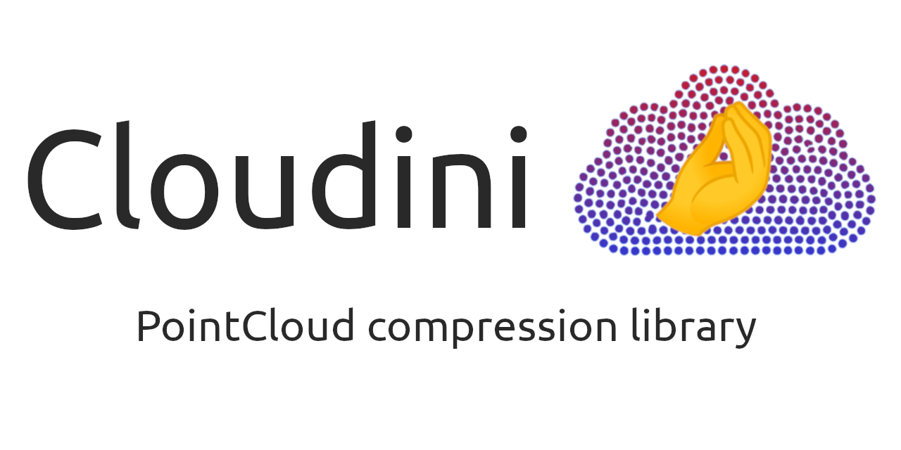

[](https://github.com/facontidavide/cloudini/actions/workflows/ubuntu-build.yaml)
[](https://github.com/facontidavide/cloudini/actions/workflows/ros-humble.yaml)
[](https://github.com/facontidavide/cloudini/actions/workflows/ros-jazzy.yaml)



**Cloudini** (pronounced with Italian accent) is a pointcloud compression
library.

Its main focus is speed, but it still achieves very good compression ratios.

Its main use cases are:

- To improve the storage of datasets containing pointcloud data (being a notable example **rosbags**).

- Decrease the bandwidth used when streaming pointclouds over a network.

It works seamlessly with [PCL](https://pointclouds.org/) and
[ROS](https://www.ros.org/), but the main library can be compiled and used independently, if needed.

# What to expect

The compression ratio is hard to predict because it depends on the way the original data is encoded.

For example, ROS pointcloud messages are extremely inefficient, because
they include some "padding" in the message that, in extreme cases, may reach up to 50%.

(Yes, you heard correctly, almost 50% of that 10 Gb rosbag is useless padding).

But, in general, you may expect considerably **better compression and faster encoding/decoding**  than ZTD or LZ4 alone.

These are two random examples using real-world data from LiDARs.

- **Channels**: XYZ, Intensity, no padding

```
  [LZ4 only]      ratio: 0.77 time (usec): 2165
  [ZSTD only]     ratio: 0.68 time (usec): 2967
  [Cloudini-LZ4]  ratio: 0.56 time (usec): 1254
  [Cloudini-ZSTD] ratio: 0.51 time (usec): 1576
```

- **Channels**: XYZ, intensity, ring (int16), timestamp (double), with padding

```
  [LZ4 only]      ratio: 0.31 time (usec): 2866
  [ZSTD only]     ratio: 0.24 time (usec): 3423
  [Cloudini-LZ4]  ratio: 0.16 time (usec): 2210
  [Cloudini-ZSTD] ratio: 0.14 time (usec): 2758
```

If you are a ROS user, you can test the compression ratio and speed yourself,
running the application `rosbag_benchmark` on any rosbag containing a `sensor_msgs::msg::PointCloud2` topic.


# How it works

The algorithm contains two steps:

1. Encoding the pointcloud, channel by channel.
2. Compression using either [LZ4](https://github.com/lz4/lz4) or [ZSTD](https://github.com/facebook/zstd).

The encoding is lossy for floating point channels (typically the X, Y, Z channels)
and lossless for RGBA and integer channels.

Now, I know that when you read the word "lossy" you may think about grainy JPEGS images. **Don't**.

The encoder applies a quantization using a resolution provided by the user.

Typical LiDARs have an accuracy/noise in the order of +/- 2 cm.
Therefore, using a resolution of **1 mm** (+/- 0.5 mm max quantization error) is usually a very conservative option.

But, if you are **really** paranoid, and decide to use a resolution of **100 microns**, you still achieve excellent compression ratios!

It should also be noted that this two-step compression strategy has a
negative overhead, i.e. it is actually **faster** than using LZ4 or ZSTD alone.

# ROS specific utilities

## point_cloud_transport plugins

See [point_cloud_transport plugins](https://github.com/ros-perception/point_cloud_transport_plugins) for reference about how they are used.

## cloudini_topic_converter

A simple node that subscribes to a compressed `point_cloud_interfaces/msg/CompressedPointCloud2` and publishes a `sensor_msgs/msg/PointCloud2`.

It is MUCH **more efficient** than using the **point_cloud_transport** because the latter would:

1. Receive a serialized DDS message.
2. Convert that to **CompressedPointCloud2**.
3. Do the actual decompression.
4. Convert **PointCloud2** to a serialized DDS message.

Instead, we work directly with **raw** serialized messages, bypassing the ROS type system, skipping steps 2 and 4 in the list above.

This means less latency and less CPU used to make unnecessary copies.

## cloudini_rosbag_converter

A command line tool that, given a rosbag (limited to MCAP format), converts
 all `sensor_msgs/msg/PointCloud2` topics into compressed `point_cloud_interfaces/msg/CompressedPointCloud2` of vice-versa.

Encoding/decoding is faster than general-purpose compression algorithms and achieves a better compression ratio at 1mm resolution.

Interestingly, it can be compiled **without** ROS installed in your system!

Example usage: round trip compression / decompression;

```
# Use option -c for compression
cloudini_rosbag_converter -f original_rosbag.mcap -o compressed_rosbag.mcap -c

# Use option -d for decompression
cloudini_rosbag_converter -f compressed_rosbag.mcap -o restored_rosbag.mcap -d
```

Note that the "restored_rosbag.mcap" might be smaller than the original one, because the chunk-based ZSTD compression provided
by MCAP is enabled.

# Frequently Asked Questions

### How does it perform, compared to Draco?

[Google Draco](https://github.com/google/draco) has two main encoding methods: SEQUENTIAL and KD_TREE.

The latter could achieve excellent compression ratios, but it is very sloooow and it doesn't preserve the original order
of the points in the point cloud.

Compared with the Draco sequential mode, Cloudini achieves approximately the same compression, but is considerably faster in
my (currently limited) benchmark.

### Does the decoder need to know if LZ4 or ZSTD was used?

No, that information is stored in the header of the compressed data, and the decoder will automatically select the right library.
