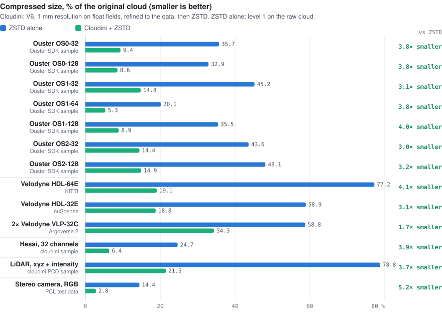
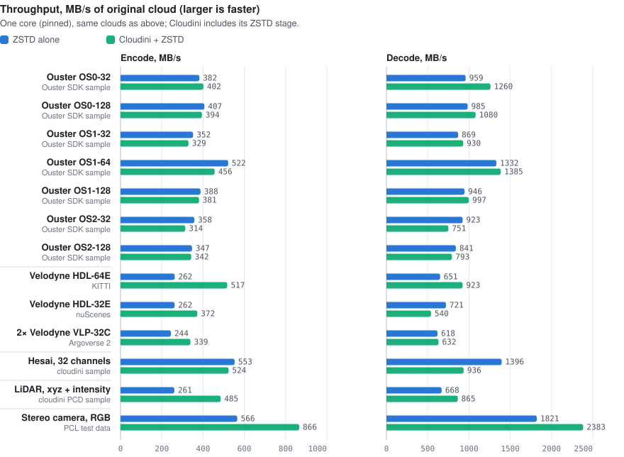

[](https://conan.io/center/recipes/cloudini)
[](https://github.com/facontidavide/cloudini/actions/workflows/ubuntu-build.yaml)
[](https://github.com/facontidavide/cloudini/actions/workflows/ros-humble.yaml)
[](https://github.com/facontidavide/cloudini/actions/workflows/ros-jazzy.yaml)
[](https://github.com/facontidavide/cloudini/actions/workflows/ros-lyrical.yaml)
[](https://github.com/facontidavide/cloudini/actions/workflows/pixi.yaml)
[](https://github.com/facontidavide/cloudini/actions/workflows/ros-rolling.yaml)


**Cloudini** (pronounced with Italian accent) is a pointcloud compression
library.

Its main focus is speed, but it still achieves very good compression ratios.

Its main use cases are:

- To improve the storage of datasets containing pointcloud data (being a notable example **rosbags**).

- Decrease the bandwidth used when streaming pointclouds over a network.

It works seamlessly with [PCL](https://pointclouds.org/) and
[ROS](https://www.ros.org/), but the main library can be compiled and used independently, if needed.

# What to expect

The compression ratio is hard to predict because it depends on the way the original data is encoded.

For example, ROS pointcloud messages are extremely inefficient, because
they include some "padding" in the message that, in extreme cases, may reach up to 50%.

(Yes, you heard correctly, almost 50% of that 10 Gb rosbag is useless padding).

But, in general, you may expect considerably **better compression**, at a similar or higher speed, than ZSTD or LZ4 alone.

These are measurements on real-world clouds from 13 sensors (public datasets and the samples in this repository), with the 1.4.0 defaults:
V6 at 1 mm resolution, refined to the data, followed by ZSTD. "ZSTD alone" is ZSTD level 1, the level Cloudini uses, on the same raw cloud.



Cloudini adds little or no time on top of ZSTD, because ZSTD has much less data left to compress:
encoding is 1.4–2× faster than ZSTD alone on the Velodyne clouds, the PCD sample and the stereo cloud, and 0.87–1.05× its speed on Ouster and Hesai.
Decoding runs at 0.67× (Hesai) to 1.42× (KITTI) the speed of ZSTD alone.



Measured on one pinned core of an i7-13700H laptop, best of 5 runs.

You can measure the compression ratio and speed on your own data with `mcap_codec_benchmark`, built with `cloudini_lib`
(no ROS needed), on any MCAP file containing `sensor_msgs/msg/PointCloud2` topics:

```
./build/release/tools/mcap_codec_benchmark my_bag.mcap --mode V6 --zstd
```

# How it works

The algorithm contains two steps:

1. Encoding the pointcloud, channel by channel.
2. Compression using either [LZ4](https://github.com/lz4/lz4) or [ZSTD](https://github.com/facebook/zstd).

The encoding is lossy for floating point channels (typically the X, Y, Z channels)
and lossless for RGBA and integer channels (packed colors stored in a FLOAT32 field
named `rgb`/`rgba` are detected by name and never quantized).

Now, I know that when you read the word "lossy" you may think about grainy JPEGS images. **Don't**.

The encoder applies a quantization using a resolution provided by the user.

Typical LiDARs have an accuracy/noise in the order of +/- 1 cm.
Therefore, using a resolution of **1 mm** (+/- 0.5 mm max quantization error) is usually a very conservative option.

# Compile instructions

Some dependencies are downloaded automatically using [CPM](https://github.com/cpm-cmake/CPM.cmake).
To avoid downloading them again when you rebuild your project, I suggest setting **CPM_SOURCE_CACHE** as described [here](https://github.com/cpm-cmake/CPM.cmake).

To build the main library (`cloudini_lib`)

```
cmake -B build/release -S cloudini_lib -DCMAKE_BUILD_TYPE=Release
cmake --build build/release --parallel
```

## ROS compilation

To compile it with ROS, just pull this repo into your **ws/src** folder and execute `colcon build` as usual.

# ROS specific utilities

For more information, see the [cloudini_ros/README.md](cloudini_ros/README.md)

- **point_cloud_transport plugins**: see [point_cloud_transport plugins](https://github.com/ros-perception/point_cloud_transport_plugins) for reference about how they are used.

- **cloudini_topic_converter**: a node that converts a `sensor_msgs/PointCloud2` topic into a compressed `point_cloud_interfaces/CompressedPointCloud2` (`compressing:=true`), or vice-versa (`compressing:=false`).

- **cloudini_rosbag_converter**: a command line tool that, given a rosbag (limited to MCAP format), converts all `sensor_msgs/PointCloud2` topics into compressed `point_cloud_interfaces/CompressedPointCloud2` or vice-versa.
  It does not need a ROS installation: a pre-compiled Linux [AppImage](https://appimage.org/) can be downloaded from the
  [release page](https://github.com/facontidavide/cloudini/releases/latest).

## Compiling the WASM module

The WebAssembly module is used by the [Foxglove extension](cloudini_foxglove/README.md), the
[Python decoder](cloudini_py/README.md) and `cloudini_web`. The following instructions assume that you have
[Emscripten installed](https://emscripten.org/docs/getting_started/downloads.html).

```
emcmake cmake -B build/wasm -S ./cloudini_lib -DCLOUDINI_BUILD_TOOLS=OFF
cd build/wasm
emmake make
```

To run **cloudini_web** locally, move back to the `cloudini` main folder and do:

```
cp -r cloudini_web build/web_deploy
cp build/wasm/cloudini_wasm.js build/web_deploy/public/
cd build/web_deploy
npm install
npm run dev
```

# Frequently Asked Questions

### I want to record "raw data". Since Cloudini is "lossy", I think I should not use it...

I disagree: you are working with noisy data in the first place.

Furthermore, I am pretty sure that your pointcloud processing algorithm is applying some sort of Voxel-based downsampling larger
than the quantization applied by this library.

If you keep the quantization error low enough, it will not affect your results in any meaningful way.

### So, which resolution do you recommend?

Look at the specifications of your sensor and use that value as a reference.

Considering that LiDARs accuracy is usually in the order of **+/- 1 cm** and that the resolution used in Cloudini is in meters:

- If the goal of the recorded pointcloud is to do visualization, use a resolution of **0.01 (1 cm)**.
- If you want to record "raw data", a resolution of **0.001 (1 mm)** is the perfect default value.
- If you are stubborn and you don't believe a single word I said, you can go as low as **0.0001 (100 microns)** and still
  see significant compression. But you are being paranoid...

### How does it perform, compared to Draco?

[Google Draco](https://github.com/google/draco) has two main encoding methods: SEQUENTIAL and KD_TREE.

The latter could achieve excellent compression ratios, but it is very sloooow and it doesn't preserve the original order
of the points in the point cloud.

Compared with the Draco sequential mode, Cloudini achieves approximately the same compression, but is considerably faster
(about 3-4 times faster encoding).

### Does the decoder need to know the parameters used while encoding?

No, that information is stored in the header of the compressed data, and the decoder will automatically select the right
decompression algorithm.

### Can older versions of Cloudini read the data I compress now?

Since 1.4.0, the encoders write the V6 format by default, and decoders from 1.3.1 and earlier cannot read it
(they report an unsupported encoding version). If some of your readers are still on those versions, write V5 instead:
`--encoding-version 5` (rosbag converter), `encoding_version:=5` (topic converter), `cloudini_encoding_version: 5`
(point_cloud_transport plugin), or `EncodingInfo::version = 5` in C++. Newer decoders read every version.
